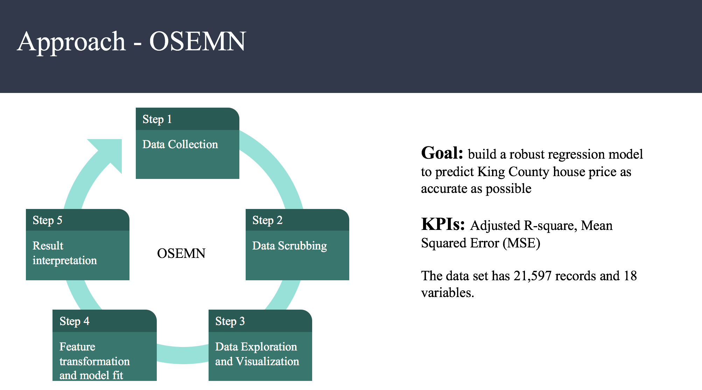
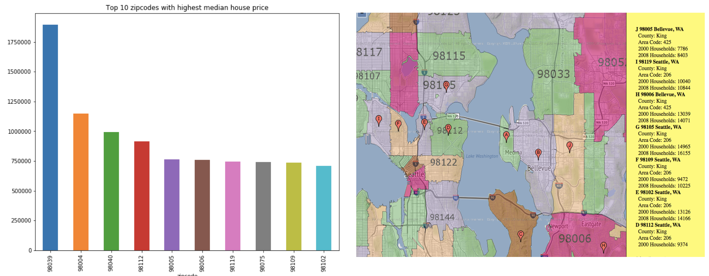
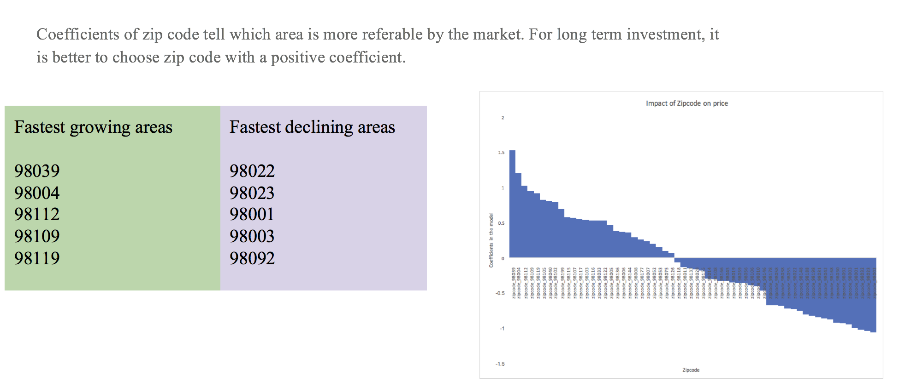
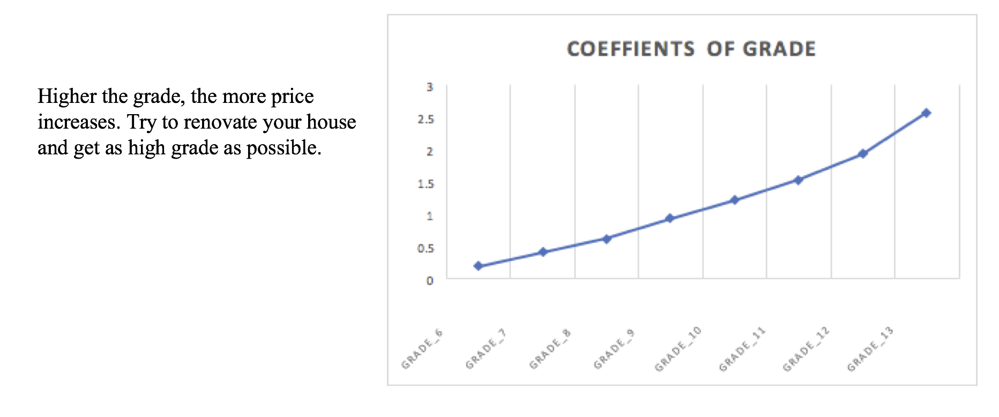

# Project Name: Predicting King County House Price with Multiple Regression 

## Table of contents
* [Project Overview](#project-overview)
* [Statistical Methods](#statistical-methods)
* [Project Workflow](#project-workflow)
* [Test Results and Implications](#test-results-and-implications)
* [Next Steps](#next-steps)

## Project Overview

King County is one of the most beautiful and populous area in the United States. It is located in the state of Washington and has the population of 2.3 million as of 2018.The growth of companies like Amazon and Microsoft has lifted the house price significantly over the past few years.

The goal of this project is to understand the drivers of King County house price by building a multiple regression model from scratch.

The [dataset](https://www.kaggle.com/harlfoxem/housesalesprediction) includes house sale prices for King County between May 2014 and May 2015. Columns include number of bathrooms, number of bedrooms, sqft of living room, lot size, number of floors, whether it is near the waterfront, has view or not, etc.

## Statistical Methods

* Multiple linear regression

## Project Workflow

### Model Set Up

Data Transformation:
- Drop variables with high collinearity or poor quality (sqft_living15, sqft_lot15, yr_renovated)
- Turn binary and ordinal variables into categorical values (bedrooms, bathrooms, waterfront, view, condition, grade, yr_built, zip code)
- Log transformation and standardization on continuous variables

Package used for model: statsmodels, sklearn

Model selection method: Forward selection and Stepwise selection

Model validation: cross-validation

## Key insights and Data Visualization
**Location is important! For prospect investors, these are the most expensive areas to buy and can probably rent a good price.**

**However, it might be smarter to target growing areas.**

**For existing house owners, if you can’t change the location, improve the grade of your house through renovation - enlarging living room size, or total lot size**

## Summary:

Based on our model, there are several ways to increase the house price:

* Improve the house condition
* Renovate and get a better grade
* Increase the size of the living space

If someone is looking to invest in a property, location is one of the most important factors to consider. Try to buy houses in the area (zip code) that is growing, not declining. And pay attention to the grade, condition of the house. If possible, buy a house with waterfront.

### [Presentation](https://github.com/bonniema/housepriceprediction-multipleregression/blob/master/King%20County%20House%20Price%20Prediction.pptx)

### [Notebook](https://github.com/bonniema/housepriceprediction-multipleregression/blob/master/KC_houseprice_prediction.ipynb)

### [Check out the blog post related to this project](https://medium.com/@BonnieMa/feature-transformation-for-multiple-linear-regression-in-python-8648ddf070b8)

